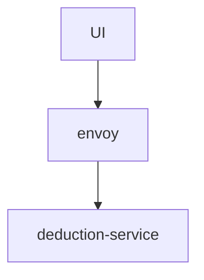

## Introduction

This is the home assignment from [Paylocity](https://www.paylocity.com/)

## Prerequisites
- [docker](https://www.docker.com/)
- docker-compose (it comes with the installation of docker desktop)
- make (it should be preinstalled with most *nix distributions)

## Build

```bash
make build
```

## Launch the services
```bash
make run
```

## Use the services
```
1. Launch the browser
2. In the browser navigate to http://localhost:8081/index.html
```

## Stop the services
```bash
make shutdown
```

## Design



### UI
The web UI is a single page where one could input the employee and his/her dependent names (if any)

### Deduction service
It is a gRPC based RPC service that calculates the yearly benefit cost for an individual.

The API is defined as:

```
// ComputeDeductionRequest represents a request for computing the deduction amount
message ComputeDeductionRequest {
  string employee_name = 1;
  message dependent {
    string name = 1;
  }
  repeated dependent dependents = 2; 
}

// ComputeDeductionResponse represents a response of list of deductions (one per pay check)
// The list is sorted by the paycheck_no ascendingly.
message ComputeDeductionResponse {
  double total_cost = 1;
  message deduction {
    int32 paycheck_no = 1;
    double deduction_amount = 2;
  }
  repeated deduction detail = 2;
}

/* DeductionService computes the deduction amount (one per paycheck) for one
 * employee.
*/
service DeductionService {
  rpc ComputeDeduction(ComputeDeductionRequest) returns (ComputeDeductionResponse);
}
```

### Envoy

It's a proxy that does the translation between ajax (used by the web UI) and HTTP2 used by gRPC. It *DOES NOT* participate in any of business logic.